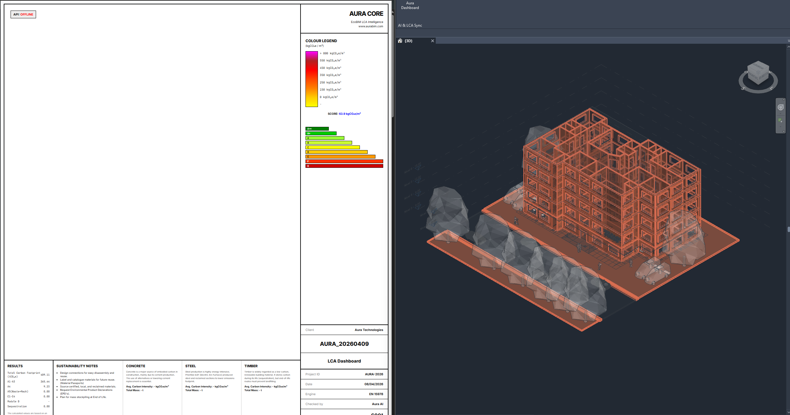

# Aura EcoBIM Intelligence 🌳



**EN 15978 Compliant Whole Life Carbon Assessment (WLCA) & Smart Material Recommendations for BIM Workflows.**

Aura EcoBIM connects directly to **Autodesk Revit 2025**, extracts geometry and material data from real BIM models, calculates highly accurate phased embodied carbon (A1-D) and suggests low-carbon alternatives using Machine Learning — all in real time.

---

## ✅ Status

> **Fully operational & Production-Ready.** Revit 2025 C# Plugin communicates seamlessly with the Python REST API. Core math engine is 100% tested against EN 15804/15978 benchmarks. Automated PDF Reporting is online.

---

## 🚀 Key Features

- **Revit Add-in (C# / .NET 8):** Extracts walls, floors, roofs, and structural elements visually via the Revit API and syncs them to the backend in real-time.
- **EN 15978 WLCA Engine:** Engineer-grade, phased calculation encompassing:
  - **A1-A3:** Product stage embodied carbon.
  - **A4:** Transport (based on DEFRA material-specific vehicle classes).
  - **A5:** Construction waste with mass-compensation algorithms.
  - **B1-B5:** Use-stage, including timber sequestration and concrete carbonation.
  - **C1-C4 & D:** End-of-Life scenarios with net recycling credits based on material taxonomy.
- **Automated Audit Reports (PDF):** Generates professional, multi-page PDF reports with KPIs, phase-distribution bar charts, and compliance flags using `reportlab` and `matplotlib`.
- **AI Material Strategist:** KNN-based recommendation engine that suggests eco-friendly alternatives with estimated CO₂ reduction percentages.
- **FastAPI REST Backend:** Secure, async API with API key authentication and performance tracking middleware.
- **Declarative Configuration:** Site-specific transport distances, waste factors, and project KPIs can be customized via a professional `ProjectConfig` dataclass.

---

## 🛠️ Technical Stack

| Layer | Technology |
|---|---|
| Backend | Python 3.12, FastAPI, Uvicorn, Pandas, Numpy |
| Reporting | ReportLab, Matplotlib |
| BIM Connector | C#, .NET 8, Revit API 2025, WPF |
| Database | SQLite (50+ materials, EN/ES/PT) |
| ML | Scikit-learn (K-Nearest Neighbors) |
| Config | Pydantic Settings + `.env` |

---

## 📂 Project Structure

```text
EcoBIM-Logic-main/
├── Aura.Revit/              # C# Revit add-in (plugin)
│   ├── src/                 # Source code (WPF Dashboard & Services)
│   ├── Install-AuraAddin.ps1
│   └── Aura.addin
├── api/                     # FastAPI REST endpoints
├── core/                    # LCA math engine (EN 15978 rules & ProjectConfig)
├── ml/                      # KNN material recommender
├── config/                  # Settings (Pydantic)
├── security/                # API key authentication
├── database/                # DB manager
├── lab/                     # Tools: setup_db.py, audit reports & simulators
│   └── reports/             # PDF generation and independent WLCA audit runners
├── .env                     # Environment variables (do NOT commit)
└── requirements.txt
```

---

## ⚡ Quick Start

### Prerequisites
- Python **3.12**
- .NET SDK 8.0
- Autodesk Revit **2025**

---

### Step 1 — Python Environment & Database

```powershell
# Create an isolated virtual environment
python -m venv venv

# Install all dependencies (includes reportlab & matplotlib for PDFs)
.\venv\Scripts\python.exe -m pip install -r requirements.txt

# Create the initial SQLite materials database
.\venv\Scripts\python.exe lab\setup_db.py
```

---

### Step 2 — Start the API

```powershell
.\venv\Scripts\python.exe -m uvicorn api.main:app --reload --port 8000
```

Verify it is running:
```powershell
GET http://localhost:8000/
→ {"status": "Aura DSS Online", "db_connected": true}
```

---

### Step 3 — Install the Revit Add-in

> ⚠️ **Close Revit before running this command.**

```powershell
cd Aura.Revit
powershell -ExecutionPolicy Bypass -File .\Install-AuraAddin.ps1
```

---

### Step 4 — Generate Professional PDF Reports (Standalone Audit)

You can run a full validation audit on a mock/exported dataset without opening Revit:

```powershell
.\venv\Scripts\python.exe lab\reports\run_wlca_report.py
```
> Outputs will be saved to `lab/reports/outputs/`, including timestamped JSON data and the final professional PDF Report.

---

## 🔐 Configuration

All settings live in `.env` (create from the template below). The file is **gitignored** — never commit it with real secrets.

```env
# API key sent by the Revit plugin in the X-Aura-API-Key header
AURA_GLOBAL_API_KEY=aura-dev-key-super-secret

# Carbon threshold in kgCO2e — elements above this are flagged as "Warning"
AURA_CARBON_THRESHOLD_KG=500

# Allowed frontend origins (comma-separated, no spaces)
AURA_ALLOWED_ORIGINS=http://localhost:5500,http://localhost:3000,http://localhost:8080
```

---

## 🗺️ Next Steps (Roadmap)

- [x] **PDF Audit Reports:** Export audit results as ESG-ready reports.
- [x] **Advanced Lifecycle Engine:** Upgrade to EN 15978 specification.
- [ ] **Shared Parameters:** Add `Aura_CarbonScore` and `Aura_MaterialStatus` shared parameters to Revit family templates so write-back works automatically.
- [ ] **Dashboard Web UI:** Build a full lifecycle web frontend (React or Streamlit) to visualize carbon data dynamically.
- [ ] **Persistent Database:** Migrate from SQLite to PostgreSQL for multi-project and multi-user support.
- [ ] **EC3 API Integration:** Pull live GWP factors from the EC3 (Embodied Carbon in Construction Calculator) API instead of static values.
- [ ] **CI/CD Pipeline:** GitHub Actions workflow to run tests and auto-build the add-in on push.

---

## 📄 License

This project is developed for sustainability audits and carbon management in the AEC industry.
See internal documentation for specific licensing terms.

---
<div align="center">
  <b>Developed with a focus on clean architecture, AI integration, and solving real-world workflow bottlenecks.</b>
  <br><br>
  <i>💡 Architecture & Engineering by <b>Maycon Alves</b></i>
  <br>
  <a href="https://github.com/MayconAlvesss" target="_blank">GitHub</a> | <a href="https://www.linkedin.com/in/maycon-alves-a5b9402bb/" target="_blank">LinkedIn</a>
</div>
